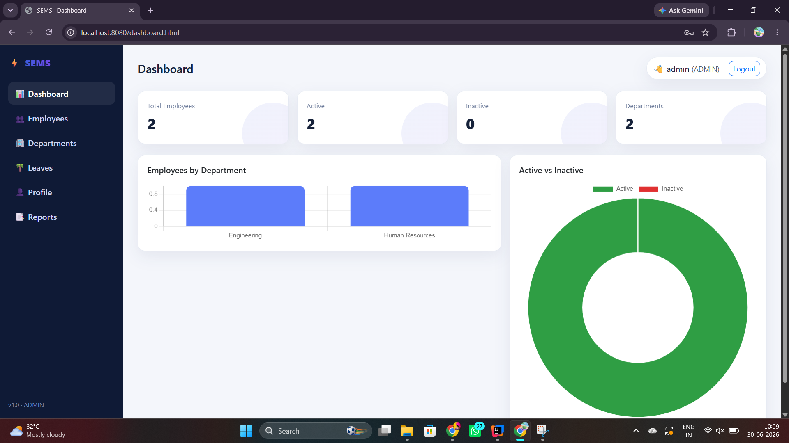
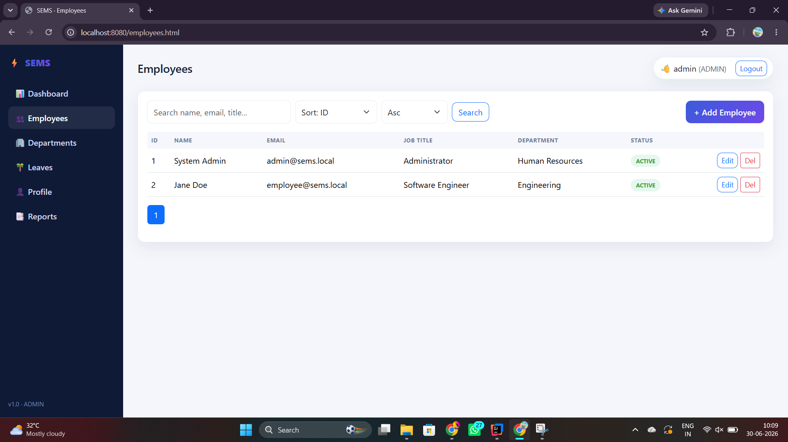
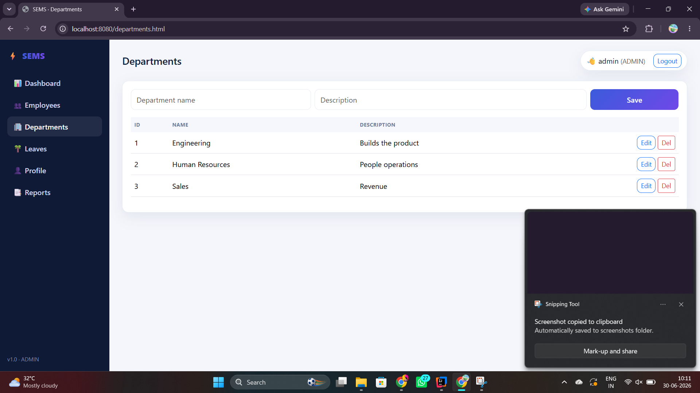
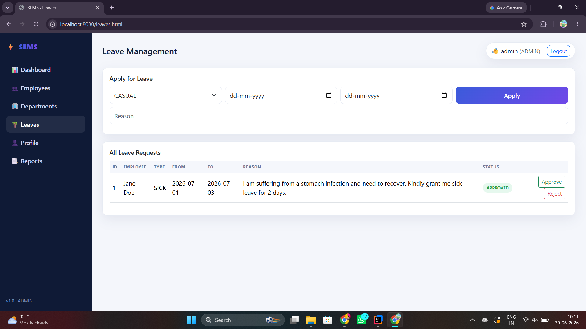
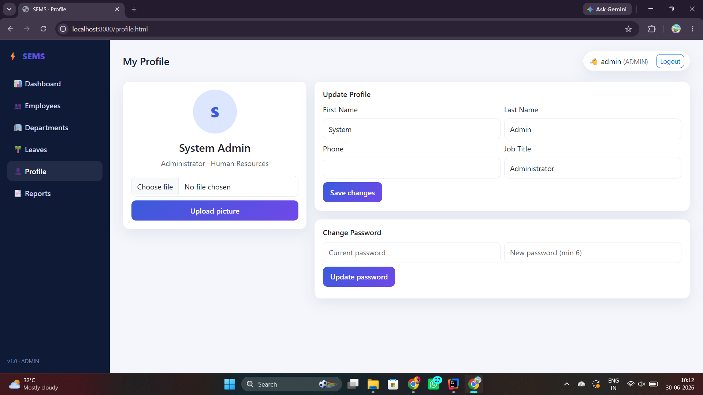

# Smart Employee Management System (SEMS)

A Full Stack Employee Management System built using **Java Spring Boot**, **Spring Security (JWT Authentication)**, **MySQL**, **HTML**, **CSS**, **JavaScript**, and **Bootstrap**.

The application helps organizations efficiently manage employees, departments, leave requests, user profiles, reports, and administrative tasks through a secure and responsive web interface.

---

## Features

* JWT Authentication & Secure Login
* Role-Based Access Control
* Employee Management (CRUD)
* Department Management (CRUD)
* Leave Management
* User Profile Management
* Interactive Dashboard with Charts
* Reports Module
* Responsive UI
* REST APIs using Spring Boot

---

## Tech Stack

### Backend

* Java
* Spring Boot
* Spring Security
* JWT Authentication
* Spring Data JPA
* Maven

### Frontend

* HTML5
* CSS3
* JavaScript
* Bootstrap

### Database

* MySQL

### Tools

* IntelliJ IDEA
* MySQL Workbench
* Git
* GitHub

---

## Project Structure

```
src/
 ├── main/
 │   ├── java/
 │   ├── resources/
 │   └── static/
 ├── uploads/
 ├── sql/
 ├── pom.xml
 └── README.md
```

---

## Screenshots

### Login Page


---

### Dashboard



---

### Employee Management



---

### Department Management



---

### Leave Management



---

### User Profile



---

## Installation

1. Clone the repository

```bash
git clone https://github.com/chandriikachintapalli/smart-employee-management-system.git
```

2. Open the project in IntelliJ IDEA.

3. Configure MySQL.

4. Update the database credentials inside:

```
src/main/resources/application.properties
```

5. Run the application.

6. Open:

```
http://localhost:8080/login.html
```

---

## Future Enhancements

* Attendance Management
* Payroll Module
* Email Notifications
* Employee Photo Management
* Advanced Reports
* Dashboard Analytics

---

## Author

**Jyothi Chandrika Chintapalli**

GitHub:
https://github.com/chandriikachintapalli
